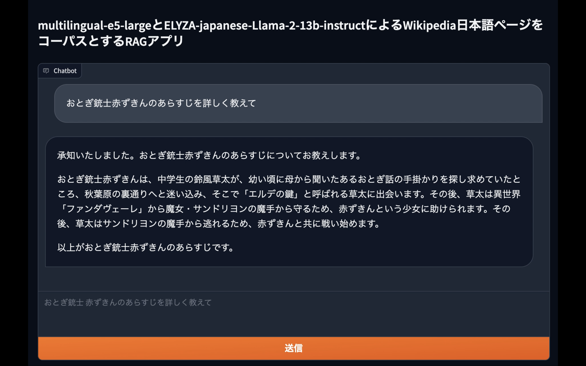
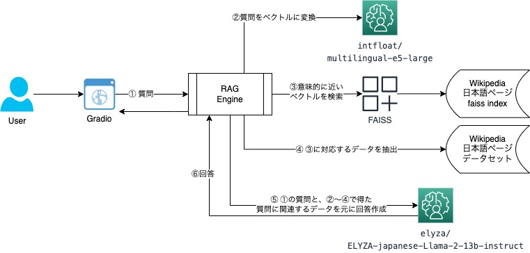

# wikipedia-japanese-open-rag
Wikipediaの日本語記事を元に、ユーザの質問に回答するGradioベースのRAGのサンプル。 

[実装の背景と詳細の解説](https://bering.hatenadiary.com/entry/2024/01/05/195141)
### コーパス
- fivehints氏による[singletongue/wikipedia-utils](https://huggingface.co/datasets/singletongue/wikipedia-utils)
- hotchpotch氏による[同データのembeddings,faiss index](https://huggingface.co/datasets/hotchpotch/wikipedia-passages-jawiki-embeddings)
### 使用モデル
- [intfloat/multilingual-e5-large](https://huggingface.co/intfloat/multilingual-e5-large)
- [elyza/ELYZA-japanese-Llama-2-13b-instruct](https://huggingface.co/elyza/ELYZA-japanese-Llama-2-13b-instruct)  





## 使い方
### 環境
torch.cuda.is_available()かつ、VRAM 96GB程度のマシンでの稼働を想定している。  
ただし、使用する[VRAMの大部分はvllmが利用するcache領域](https://github.com/vllm-project/vllm/discussions/241)であるため、`gpu_memory_utilization`を指定することでVRAM 40GB程度まで必要量を削減可能。(ELYZA-japanese-Llama-2-13b-instructが30GB弱、multilingual-e5-largeが10GB弱)  
```python
        engine_args = AsyncEngineArgs(model=LLM_MODEL_ID, dtype='bfloat16',
                                      tensor_parallel_size=4,
                                      disable_log_requests=True,
                                      disable_log_stats=True,
                                      gpu_memory_utilization=0.6) # ←ここでVRAM全体の何％を推論に割り当てるかを指定する(ここでは60%)
```
GPU VRAMは必ずしも単一のGPUで供給する必要はなく、マシンが複数のGPUを利用可能な場合は`tensor_parallel_size`を指定することで分散的に推論できる。  
```python
        engine_args = AsyncEngineArgs(model=LLM_MODEL_ID, dtype='bfloat16',
                                      tensor_parallel_size=4, # ←ここでGPUの数を指定
                                      disable_log_requests=True,
                                      disable_log_stats=True,
                                      gpu_memory_utilization=0.6)
```
### Stand AloneモードとAPIモード
GradioのUIと推論エンジンを同一のPythonプロセスで稼働させるStand Aloneモードと、UIと推論を異なるプロセスに分割して連携させるAPIモードを用意している。Stand Aloneモードはシンプルに運用可能な反面、スケーラビリティに限界がある。  
APIモードでは、推論部分をFast APIに切り出しており、n台のノードにAPIをデプロイし、適切にロードバランスしてGradioのUIからcallすることでスケールアウトするような用途を想定している。
#### Stand Aloneモード
```shell
pip install -r requirements.txt
python app.py # 同一プロセスでGUIとRAG(検索、推論)を実行
```
#### APIモード
```shell
pip install -r requirements.txt
python app.py --api_mode # UIのみを起動。検索、推論時はgunicornのapiを呼び出す
gunicorn -w 1 --timeout 0 -k uvicorn.workers.UvicornWorker rag_inf_api:app # 適宜別ノードから起動
```

